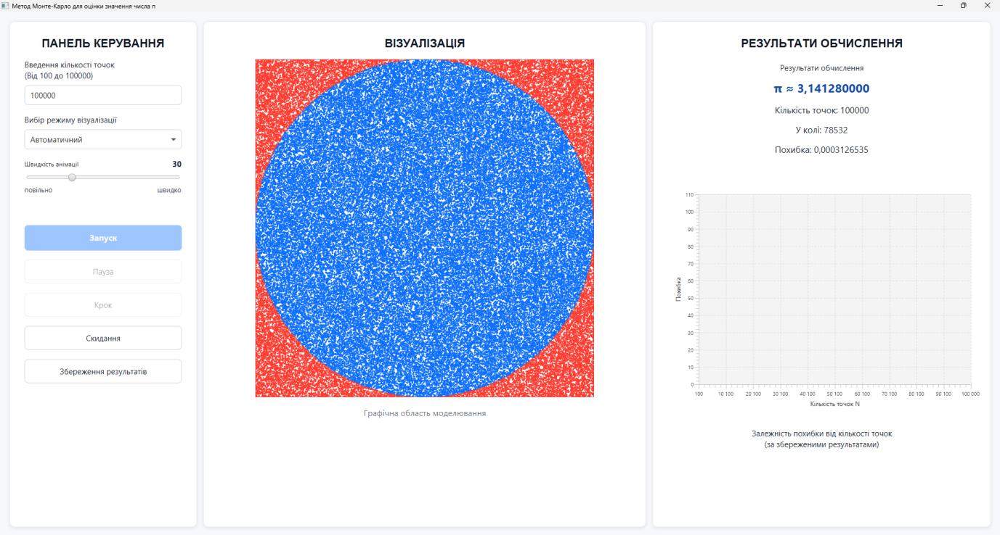
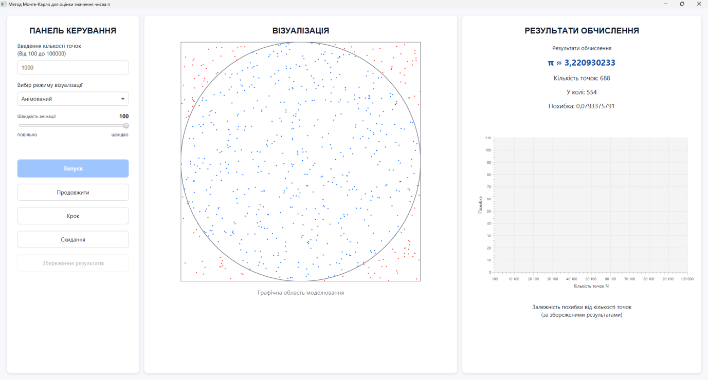
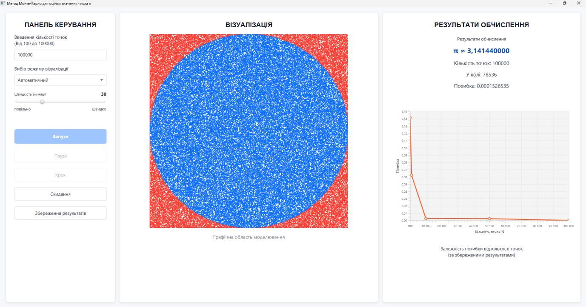

# Monte Carlo π Visualizer

A desktop application that demonstrates how the Monte Carlo method can be used to estimate the value of π. Random points are generated inside a square, classified by whether they fall within the inscribed circle, and displayed in real time using JavaFX.

The project was developed as university coursework to combine probabilistic modelling, object-oriented design and interactive data visualization.



## How it works

For a total of `N` generated points and `k` points located inside the circle, the application estimates π as:

```text
π ≈ 4 × k / N
```

As the number of generated points increases, the estimate usually converges toward the reference value of π, although individual runs vary because the simulation is random.

## Features

- Automatic simulation mode for rapid calculation
- Animated mode with adjustable visualization speed
- Pause, resume and step-by-step execution
- Input validation for simulations from 100 to 100,000 points
- Live visualization of points inside and outside the circle
- Estimated π value and absolute-error calculation
- In-session result history
- Error-versus-sample-size chart for saved runs
- Reset and repeat simulation controls

## Interface

The application interface is in Ukrainian.

### Animated execution



### Comparing saved results



## Technologies

- Java 17
- JavaFX 21
- Maven
- Object-oriented architecture

## Project structure

```text
src/main/java/com/coursework/montecarlo/
├── algorithm/   # Monte Carlo simulation logic
├── model/       # Points, parameters, statistics and results
└── ui/          # JavaFX interface and user interactions
```

## Running the application

Requirements:

- JDK 17 or newer
- Apache Maven

Clone the repository and run:

```bash
mvn clean javafx:run
```

## Validation

The project documentation contains 15 manual test scenarios covering:

- valid and invalid point counts;
- lower and upper input boundaries;
- automatic and animated execution;
- pause, resume and step controls;
- resetting the simulation;
- saving completed results to the in-session history;
- updating the error chart.

The application was also demonstrated during the coursework defence.

## Documentation

The complete Ukrainian-language explanatory report is available here:

[Coursework report (PDF)](docs/monte-carlo-coursework-report-ua.pdf)

It describes the mathematical method, functional requirements, architecture, implementation, interface and testing process.

## Academic context

- Course project: graphical interpretation of the Monte Carlo method for estimating π
- Taras Shevchenko National University of Kyiv
- Developed independently by Veronika Katasonova
- Final grade: 94/100

## Current limitations

- The interface is available only in Ukrainian.
- Saved results remain in memory during the current application session and are not exported to a file.
- The result is stochastic and therefore differs between runs.

